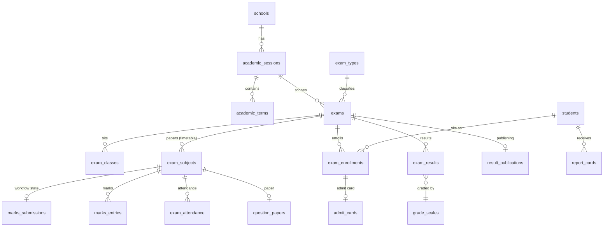
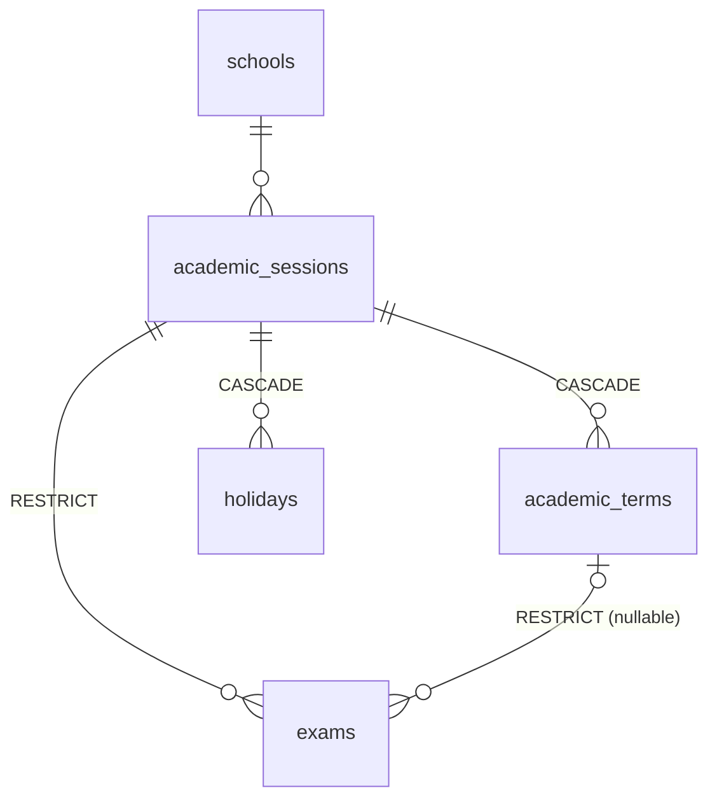
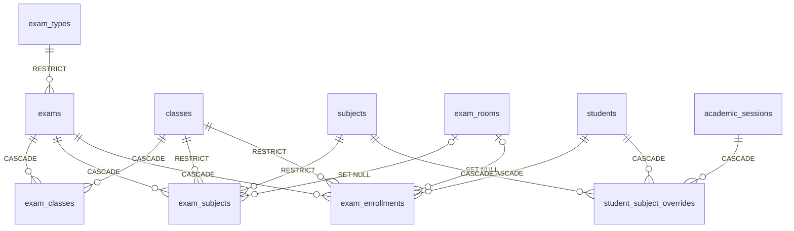
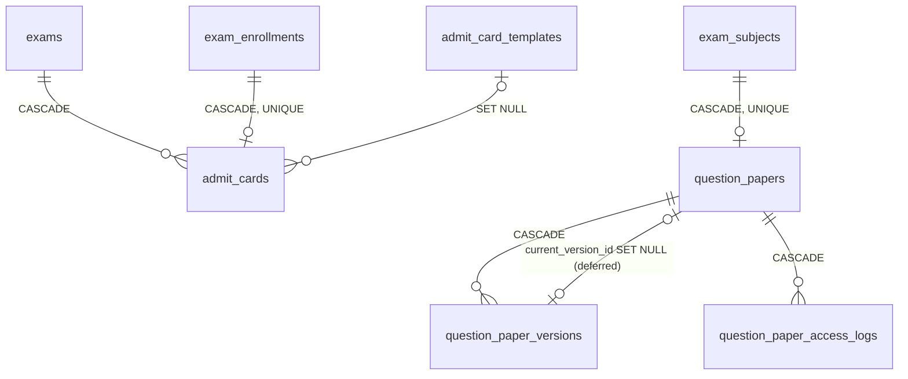
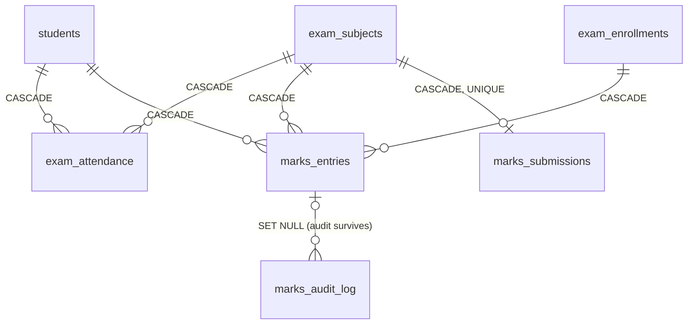
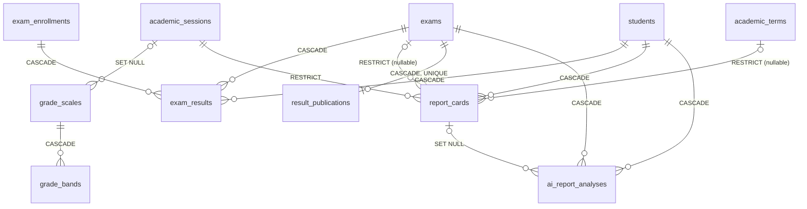
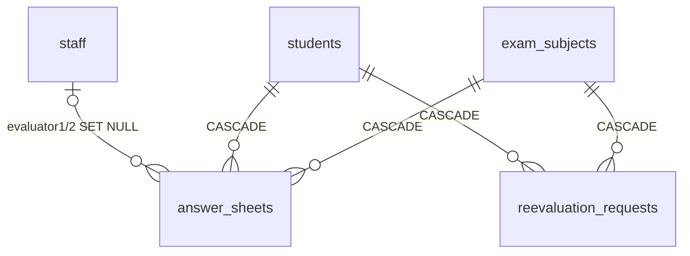

# Exam Module — Step 3: Relationships (ERD, cardinalities, delete behavior)

Companion to `architecture.md` (Steps 1–2). This document is the authoritative map of
every foreign key the module introduces, its cardinality, its `ON DELETE` behavior, and
the reasoning — so the Step 10 migrations can be generated mechanically from it.

---

## 3.1 Deletion philosophy (read first)

1. **Tenant wipe is total.** Every table carries `school_id … ON DELETE CASCADE`.
   Deleting a school removes the entire exam history — same as every existing module.
2. **Academic history is archived, never deleted.** Sessions, terms, subjects, classes
   and exam types referenced by real exam data are protected with `RESTRICT`.
   The UI offers *lock/archive/deactivate*, not delete.
3. **Only `draft` and `cancelled` exams are deletable**, and only via the
   `delete_exam(exam_id)` RPC. Once an exam has issued report cards, `RESTRICT` from
   `report_cards.exam_id` makes deletion impossible even for that RPC.
4. **Students are soft-deleted** (`is_active = false`) in normal operation, matching the
   existing modules. Hard student deletion cascades through exam data (house style —
   `fees`, `attendance` already do this).
5. **Audit rows outlive their subjects.** Audit tables reference volatile rows with
   `SET NULL` and carry denormalized copies (student_id, exam_subject_id) so history
   survives cleanup.
6. **People columns** (`created_by`, `marked_by`, `entered_by`, `reviewed_by`, …) are
   always `→ profiles ON DELETE SET NULL` (house style).

---

## 3.2 Overview ERD — the module spine

## 3.3 Group ERDs

### A — Sessions

### B — Exam core

### C — Logistics

### D + E — Attendance, marks, workflow

### F — Results & report cards

### G — Future-ready

---

## 3.4 Complete FK & delete-behavior matrix

`⚑` = new table introduced by this module. Cardinality reads left→right
(e.g. `exams 1—N exam_subjects`).

| # | From (column) | To | Card. | ON DELETE | Why |
|---|---|---|---|---|---|
| 1 | *every ⚑ table* `.school_id` | schools | N—1 | CASCADE | Tenant isolation + tenant wipe (house rule) |
| 2 | academic_terms.session_id | academic_sessions | N—1 | CASCADE | Terms are components of a session |
| 3 | holidays.session_id | academic_sessions | N—1 | CASCADE | Holiday calendar belongs to the session |
| 4 | exams.session_id | academic_sessions | N—1 | **RESTRICT** | Never lose exam history by deleting a session; archive instead |
| 5 | exams.term_id (nullable) | academic_terms | N—0..1 | **RESTRICT** | Same — reorganizing terms must not orphan/erase exams |
| 6 | exams.exam_type_id | exam_types | N—1 | **RESTRICT** | Catalogue rows are deactivated (`is_active=false`), not deleted |
| 7 | exam_classes.exam_id | exams | N—1 | CASCADE | Config rows die with the (draft) exam |
| 8 | exam_classes.class_id | classes | N—1 | CASCADE | Mirror of `class_teachers`/`subject_assignments` house style; pure config, no marks attached |
| 9 | exam_subjects.exam_id | exams | N—1 | CASCADE | Papers die with the exam (deletable only in draft/cancelled) |
| 10 | exam_subjects.class_id | classes | N—1 | **RESTRICT** | A paper may carry marks/results — class deletion must be blocked once exams reference it |
| 11 | exam_subjects.subject_id | subjects | N—1 | **RESTRICT** | Subjects with exam history are deactivated, never deleted |
| 12 | exam_subjects.room_id (nullable) | exam_rooms | N—0..1 | SET NULL | Room removal shouldn't break the timetable; validator flags missing rooms |
| 13 | exam_enrollments.exam_id | exams | N—1 | CASCADE | — |
| 14 | exam_enrollments.student_id | students | N—1 | CASCADE | House style (`fees`, `attendance`); soft-delete is the operational path |
| 15 | exam_enrollments.class_id | classes | N—1 | **RESTRICT** | Enrollment carries roll numbers referenced by admit cards/results |
| 16 | exam_enrollments.room_id (nullable) | exam_rooms | N—0..1 | SET NULL | Same as #12 |
| 17 | student_subject_overrides.session_id | academic_sessions | N—1 | CASCADE | Override is meaningless outside its session |
| 18 | student_subject_overrides.student_id | students | N—1 | CASCADE | — |
| 19 | student_subject_overrides.subject_id | subjects | N—1 | CASCADE | Config row, no history value on its own |
| 20 | admit_cards.exam_id | exams | N—1 | CASCADE | — |
| 21 | admit_cards.enrollment_id | exam_enrollments | 1—0..1 | CASCADE | UNIQUE — one card per enrollment; regenerate = revoke + new row |
| 22 | admit_cards.template_id (nullable) | admit_card_templates | N—0..1 | SET NULL | Card data survives template cleanup |
| 23 | question_papers.exam_subject_id | exam_subjects | 1—0..1 | CASCADE | UNIQUE — one paper record per exam paper |
| 24 | question_paper_versions.question_paper_id | question_papers | N—1 | CASCADE | Versions are components |
| 25 | question_papers.current_version_id (nullable) | question_paper_versions | 0..1—1 | SET NULL | **Circular FK** — see §3.5 |
| 26 | question_paper_access_logs.question_paper_id | question_papers | N—1 | CASCADE | Log scoped to the paper; module-wide trail lives in exam_audit_log |
| 27 | question_paper_access_logs.version_id (nullable) | question_paper_versions | N—0..1 | SET NULL | Log survives version pruning |
| 28 | exam_attendance.exam_subject_id | exam_subjects | N—1 | CASCADE | — |
| 29 | exam_attendance.student_id | students | N—1 | CASCADE | — |
| 30 | marks_entries.exam_subject_id | exam_subjects | N—1 | CASCADE | Frozen-guard trigger prevents casual deletion long before FK matters |
| 31 | marks_entries.student_id | students | N—1 | CASCADE | — |
| 32 | marks_entries.enrollment_id | exam_enrollments | N—1 | CASCADE | Marks can't exist for a non-enrolled student |
| 33 | marks_submissions.exam_subject_id | exam_subjects | 1—0..1 | CASCADE | UNIQUE — one workflow row per paper |
| 34 | marks_audit_log.marks_entry_id (nullable) | marks_entries | N—0..1 | **SET NULL** | Audit must survive the row it audits; denormalized student/paper ids retained |
| 35 | grade_bands.grade_scale_id | grade_scales | N—1 | CASCADE | Bands are components; GiST exclusion prevents overlap |
| 36 | grade_scales.session_id (nullable) | academic_sessions | N—0..1 | SET NULL | Scale falls back to school-default scope |
| 37 | exam_results.exam_id | exams | N—1 | CASCADE | Results are derived data; recomputable |
| 38 | exam_results.student_id | students | N—1 | CASCADE | — |
| 39 | exam_results.enrollment_id | exam_enrollments | N—1 | CASCADE | — |
| 40 | exam_results.grade_scale_id (nullable) | grade_scales | N—0..1 | **RESTRICT** | A scale used by computed results cannot be deleted (recompute would silently change grades) |
| 41 | report_cards.session_id | academic_sessions | N—1 | **RESTRICT** | Report cards are quasi-legal documents |
| 42 | report_cards.exam_id (nullable) | exams | N—0..1 | **RESTRICT** | Blocks `delete_exam` once cards are issued (see §3.1.3) |
| 43 | report_cards.term_id (nullable) | academic_terms | N—0..1 | **RESTRICT** | Same |
| 44 | report_cards.student_id | students | N—1 | CASCADE | Hard student deletion is the one sanctioned wipe |
| 45 | result_publications.exam_id | exams | 1—0..1 | CASCADE | UNIQUE — one publication row per exam |
| 46 | ai_report_analyses.student_id | students | N—1 | CASCADE | Derived, regenerable |
| 47 | ai_report_analyses.exam_id | exams | N—1 | CASCADE | — |
| 48 | ai_report_analyses.report_card_id (nullable) | report_cards | N—0..1 | SET NULL | Analysis usable standalone |
| 49 | answer_sheets.exam_subject_id | exam_subjects | N—1 | CASCADE | Future |
| 50 | answer_sheets.student_id | students | N—1 | CASCADE | Future |
| 51 | answer_sheets.evaluator1_id / evaluator2_id (nullable) | staff | N—0..1 | SET NULL | Evaluation record survives staff exit |
| 52 | reevaluation_requests.exam_subject_id | exam_subjects | N—1 | CASCADE | Future |
| 53 | reevaluation_requests.student_id | students | N—1 | CASCADE | Future |
| 54 | *all people columns* (`created_by`, `entered_by`, `marked_by`, `generated_by`, `published_by`, `locked_by`, `uploaded_by`, `computed_by`, `decided_by`, …) | profiles | N—0..1 | SET NULL | House style — records outlive accounts |

Every FK column in this matrix receives an index in the Step 10 migrations
(most as the trailing column of a composite starting with the natural query key,
e.g. `(exam_id, class_id)` on exam_subjects covers both #9 lookups and uniqueness).

---

## 3.5 Circular / deferred constraints

One intentional cycle: `question_papers.current_version_id → question_paper_versions`
while `question_paper_versions.question_paper_id → question_papers`.

- Declared `DEFERRABLE INITIALLY DEFERRED` so the upload RPC can insert the version and
  point the parent at it in one transaction.
- `ON DELETE SET NULL` so pruning a version never blocks; the upload RPC repoints to the
  latest remaining version.

No other cycles exist in the graph (verified: the matrix above is otherwise a DAG rooted
at `schools`).

---

## 3.6 Same-school integrity triggers (defense in depth beyond RLS)

Following the `tg_check_class_teacher_school()` precedent, BEFORE INSERT/UPDATE triggers
verify that all cross-referenced rows share the row's `school_id`:

| Trigger | Table | Verifies |
|---|---|---|
| `tg_ck_exam_school` | exams | session, term, exam_type |
| `tg_ck_exam_class_school` | exam_classes | exam, class |
| `tg_ck_exam_subject_school` | exam_subjects | exam, class, subject, room; **and** (exam, class) ∈ exam_classes |
| `tg_ck_enrollment_school` | exam_enrollments | exam, student, class, room; student's class matches |
| `tg_ck_override_school` | student_subject_overrides | session, student, subject |
| `tg_ck_admit_card_school` | admit_cards | exam, enrollment, template |
| `tg_ck_exam_att_school` | exam_attendance | exam_subject, student; student enrolled in that exam |
| `tg_ck_marks_school` | marks_entries | exam_subject, student, enrollment all consistent |
| `tg_ck_result_school` | exam_results | exam, student, enrollment, grade_scale |
| `tg_ck_report_card_school` | report_cards | session/term/exam, student |

Plus the behavioral guards already specified in Step 2:
`tg_session_not_locked` (writes into locked/archived sessions),
`tg_marks_frozen_guard` (edits after submit/freeze),
`tg_validate_marks` (component ≤ max, absent ⇒ NULL marks, grace cap),
audit-writer triggers on `marks_entries`.

---

## 3.7 Cardinality quick-reference (business language)

- One school → many sessions; **exactly one current** session (partial unique index).
- One session → many terms, many exams, many holidays, optional grade scales.
- One exam → many classes, many papers (`exam_subjects`), many enrollments,
  one optional publication row.
- One paper (exam × class × subject) → ≤1 question paper (→ many versions),
  one optional marks-submission workflow row, many marks entries (one per student),
  many attendance rows (one per student).
- One enrollment → ≤1 admit card, many marks entries (one per paper), ≤1 result per exam.
- One student → one enrollment per exam, one result per exam, one report card per
  exam/term/session scope, session-scoped subject overrides.
- One grade scale → many bands (non-overlapping, DB-enforced).

---

*Next: Step 4 — Workflow design (state machines, actor swim-lanes, RPC sequence for each
lifecycle: exam, timetable, admit cards, question papers, marks → verification → freeze →
results → publishing).*
