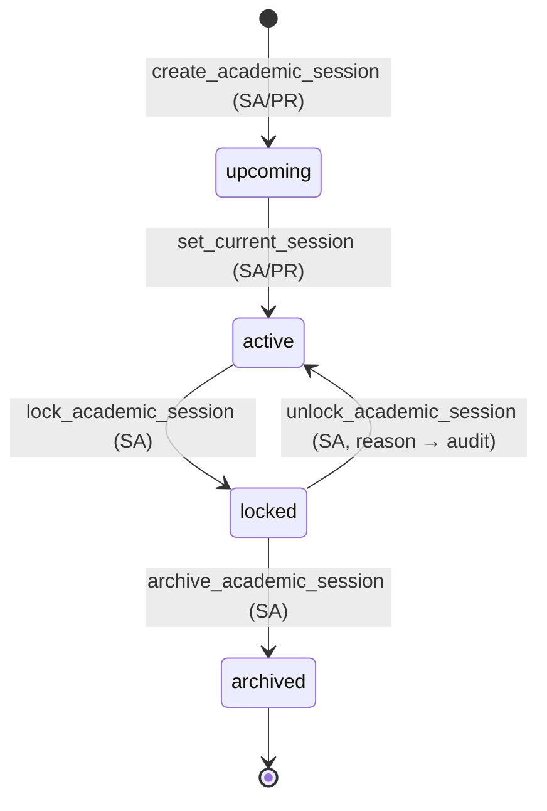
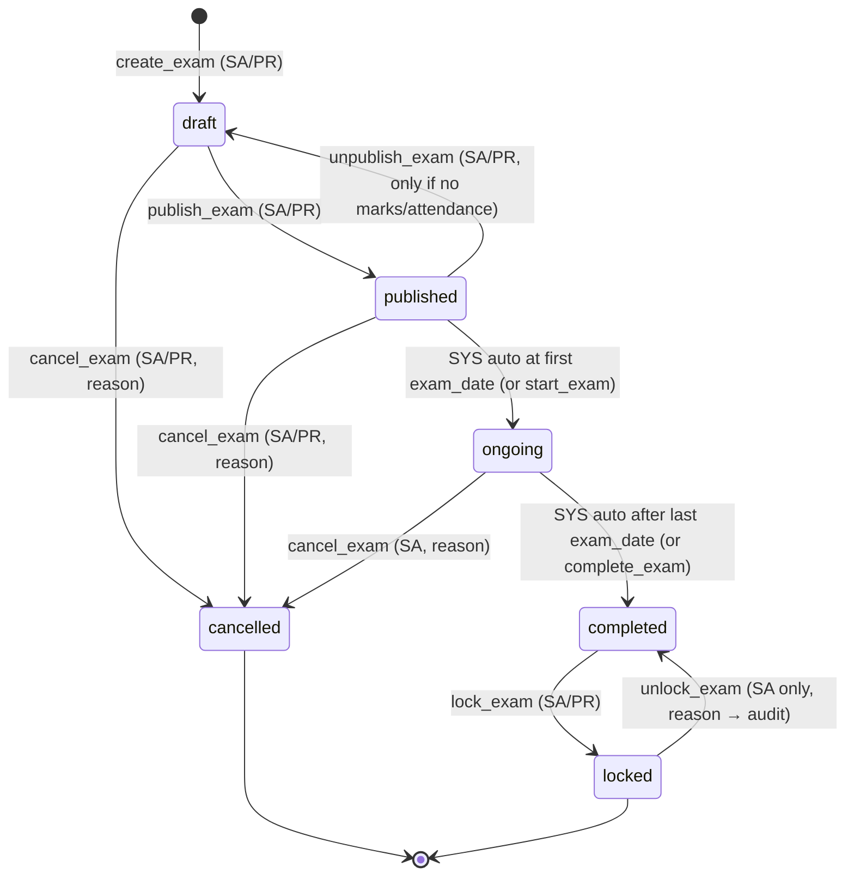
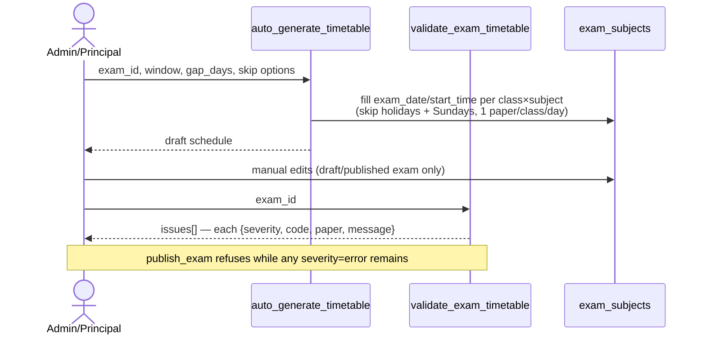
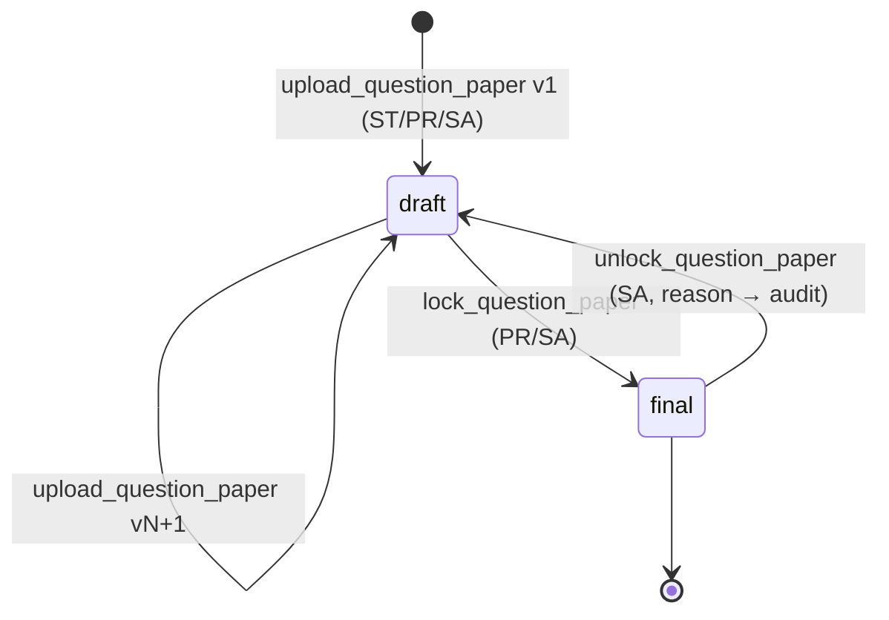
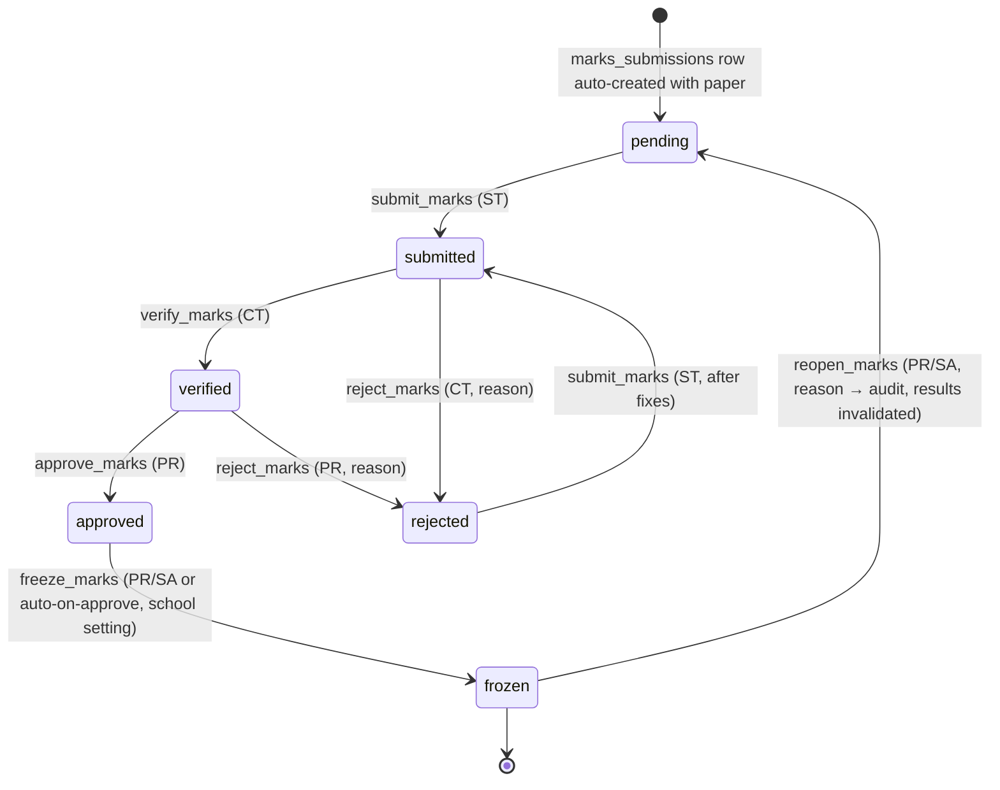
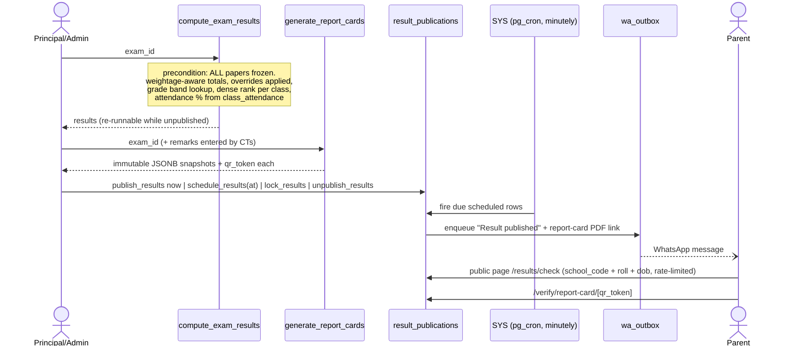

# Exam Module — Step 4: Workflow Design

Companion to `architecture.md` (Steps 1–2) and `03-relationships.md` (Step 3).
Every state transition below is driven by exactly one SECURITY DEFINER RPC — there is no
path to these states through direct table writes (RLS grants reads; write policies exist
only where harmless, e.g. draft-exam config edits by admin/principal).

Actor legend: **SA** school_admin · **PR** principal · **CT** class teacher (of the
class) · **ST** subject teacher (assigned via `subject_assignments`) · **SYS** pg_cron /
edge function · **PUB** anonymous public.

---

## 4.1 Academic session lifecycle



Rules:

- `set_current_session` atomically clears the previous `is_current` flag (single UPDATE,
  partial unique index is the backstop).
- `locked`: every exam-module write RPC begins with `assert_session_mutable(session_id)`;
  the `tg_session_not_locked` trigger is the second lock on direct writes.
- `archived` is terminal: hidden from pickers, visible in history/reports. Unarchive is
  deliberately not provided (restore = support operation, not a product feature).
- Term dates are editable while the session is `upcoming`/`active` and no exam references
  the term with frozen marks.

## 4.2 Exam lifecycle



What each state permits:

| Capability | draft | published | ongoing | completed | locked | cancelled |
|---|---|---|---|---|---|---|
| Edit config (classes/subjects/marks scheme) | ✓ | — | — | — | — | — |
| Edit timetable (dates/times/rooms) | ✓ | ✓ | — | — | — | — |
| Generate enrollments / admit cards | — | ✓ | ✓ | — | — | — |
| Upload question papers | ✓ | ✓ | ✓¹ | — | — | — |
| Mark exam attendance | — | — | ✓ | ✓² | — | — |
| Enter/submit marks | — | — | ✓ | ✓ | — | — |
| Verify/approve/freeze marks | — | — | ✓ | ✓ | — | — |
| Compute results / report cards | — | — | — | ✓ | ✓³ | — |
| Publish results | — | — | — | ✓ | ✓ | — |
| Delete exam (`delete_exam`) | ✓ | — | — | — | — | ✓⁴ |

¹ per-paper: blocked once that paper's date has passed. ² late corrections by PR only.
³ recompute blocked once `result_publications.status='locked'`.
⁴ blocked by `RESTRICT` if report cards exist.

`publish_exam` preconditions (validated inside the RPC, all-or-nothing):
≥1 class, ≥1 subject per class, every paper has date+time+duration, timetable validator
returns zero errors, session is active. On success: enrollments generated, WA
notification enqueued (schedule), audit row written.

## 4.3 Timetable generation & validation



Validator rule set (returns rows, never raises):

| Code | Severity | Rule |
|---|---|---|
| `MISSING_SCHEDULE` | error | paper has no date/time/duration |
| `CLASS_OVERLAP` | error | same class, two papers overlapping in time |
| `HOLIDAY_CLASH` | error | paper dated on `holidays` row |
| `OUT_OF_RANGE` | error | paper outside exam start/end window |
| `ROOM_OVERFLOW` | warning | room capacity < enrolled students at that slot |
| `ROOM_DOUBLE_BOOKED` | warning | same room, overlapping slots, different classes |
| `SAME_DAY_LOAD` | warning | class has >1 paper same day (allowed but flagged) |

## 4.4 Enrollment & admit cards

```mermaid
sequenceDiagram
    actor A as Admin/Principal
    participant E as generate_exam_enrollments
    participant C as generate_admit_cards
    participant PDF as /api/exams/[id]/admit-cards (PDF route)
    actor P as Parent (WhatsApp)

    A->>E: exam_id (runs inside publish_exam; re-runnable)
    E-->>A: enrolled N, skipped M (already enrolled), roll numbers assigned
    A->>C: exam_id, class_id?, template_id
    C-->>A: cards created (qr_token minted per enrollment)
    A->>PDF: layout=single|2up|3up|4up, class filter
    PDF-->>A: A4 PDF stream (bulk print)
    C--)P: wa_outbox: "Admit card ready" (optional toggle)
```

- Re-running enrollment after **late admission** appends the next roll number per class —
  existing roll numbers and printed admit cards are never renumbered.
- **Reprint** increments `print_count` (audit trail of how many copies exist).
- Data fix after issue (name/photo) → `revoke_admit_card` + regenerate: new row, new QR;
  revoked token verifies as *revoked* at the gate.
- Admit card QR payload = `qr_token` only (no PII in the QR).

## 4.5 Question papers



- Upload/replace allowed only for the paper's assigned subject teacher(s) (via
  `teaches_subject_in_class`) + PR/SA; each upload = new immutable version row.
- Once `final`: uploads rejected; file access continues via `get_question_paper_url`
  (signed URL, 60 s expiry) which **always** inserts an access-log row first.
- Every access-log row: who, which version, action, timestamp — downloadable audit for
  leak investigations.

## 4.6 Exam attendance (per paper)

```mermaid
sequenceDiagram
    actor T as Invigilator (ST/CT/PR)
    participant S as /scan (existing scanner page, exam mode)
    participant R as record_exam_attendance_scan
    participant M as mark_exam_attendance_bulk

    T->>S: scan admit-card QR at room
    S->>R: qr_token, exam_subject_id
    R-->>S: student {name, photo, roll, seat} — visual verification
    R->>R: upsert present (or late if now > start_time)
    Note over T,M: fallback / corrections
    T->>M: exam_subject_id, rows[{student_id, status, remarks}]
    M-->>T: saved; absent/medical flow into marks validation
```

- Statuses: `present · absent · medical · late`. Unique per (paper, student) — re-scan
  updates, never duplicates.
- Gate scans on exam day may also stamp `attendance.exam_id` (existing reserved column) —
  informational only; the exam-room record above is authoritative.
- Report: `get_exam_attendance_report(exam_id)` — per class × paper matrix.

## 4.7 Marks entry → verification → freeze (the core workflow)



```mermaid
sequenceDiagram
    actor ST as Subject Teacher
    actor CT as Class Teacher
    actor PR as Principal
    participant DB as marks_entries + marks_submissions

    ST->>DB: save_marks_bulk (autosave, debounced)<br/>allowed only in pending/rejected
    ST->>DB: submit_marks(exam_subject_id)
    Note over DB: completeness check — every enrolled non-exempt student<br/>has marks OR is_absent (cross-checked vs exam_attendance)
    DB-->>CT: paper appears in "to verify" queue
    CT->>DB: verify_marks / reject_marks(reason)
    DB-->>PR: paper appears in "to approve" queue
    PR->>DB: approve_marks / reject_marks(reason)
    PR->>DB: freeze_marks
    Note over DB: tg_marks_frozen_guard now rejects ALL edits;<br/>every action above wrote marks_audit_log rows
```

Write-permission truth table for `marks_entries` (enforced by RLS + trigger together):

| Submission status | ST (assigned) | CT | PR/SA |
|---|---|---|---|
| pending / rejected | write | read | read |
| submitted / verified / approved | read | read | read |
| frozen | read | read | read (reopen_marks only path back) |

Edge behaviors:

- **Grace marks**: separate column, RPC-capped by school setting; audited individually.
- **Teacher replaced mid-exam**: reassignment in `subject_assignments` instantly moves
  write access; history intact (`entered_by` unchanged on old rows).
- **Reopen after freeze**: sets status `pending`, writes audit row with mandatory reason,
  and marks dependent `exam_results` stale (`is_final=false`) — recompute required before
  re-publish.

## 4.8 Results → report cards → publishing



Publishing rules:

- `publish_results` requires: exam `completed`/`locked`, results computed and current
  (no stale flag), report cards generated.
- `unpublish_results` allowed until `lock_results`; unpublish hides portal/public access
  and writes an audit row (WhatsApp messages already sent are logged, not recalled).
- `lock_results` is terminal for the publication AND blocks `reopen_marks` for the exam.
- Public endpoints return minimal payloads (name, class, roll, result status, grades) —
  never phone numbers, never other students' data; both rate-limited via the existing
  `auth_rate_limit` mechanism.

## 4.9 AI analysis (Phase 10, provider decided later)

Trigger points: on-demand per student (PR/CT), or batch after publication (SYS).
Edge function reads: current result + up to N previous exam results (trend), attendance,
class averages → writes `ai_report_analyses` (status `pending → completed | failed`).
Idempotent per `(exam_id, student_id, prompt_version)` — regeneration bumps
`prompt_version`. UI renders from the cached JSONB; the report-card PDF embeds the
summary section only if analysis is `completed`.

## 4.10 Notification touchpoints (all via existing `wa_outbox`)

| Event | Recipients | Template key |
|---|---|---|
| Exam published (schedule) | parents of enrolled students | `exam_schedule` |
| Admit cards generated | parents | `admit_card_ready` |
| Timetable changed after publish | parents of affected classes | `exam_schedule_change` |
| Marks submission pending (T-2 days before deadline) | subject teachers | `marks_reminder` |
| Paper rejected | subject teacher | `marks_rejected` |
| Results published | parents | `result_published` |

Teacher notifications reuse the same outbox with staff mobile numbers; per-school WA
quota and toggles (existing `schools` columns) gate everything — a new
`wa_exam_notifications_enabled` toggle follows the existing per-feature flag pattern.

## 4.11 RPC catalog (complete list this design commits to)

| # | RPC | Actor guard | Phase |
|---|---|---|---|
| 1 | create_academic_session / update | SA/PR + `sessions.manage` | 1 |
| 2 | set_current_session | SA/PR | 1 |
| 3 | lock/unlock/archive_academic_session | SA (unlock: reason) | 1 |
| 4 | seed_default_exam_types | auto on first session | 1 |
| 5 | create_exam / update_exam (draft only) | SA/PR + `exams.manage` | 1 |
| 6 | set_exam_classes / upsert_exam_subjects | SA/PR, draft only | 1 |
| 7 | publish_exam / unpublish_exam | SA/PR + `exams.publish` | 1 |
| 8 | start_exam / complete_exam (+ SYS auto) | SA/PR | 1 |
| 9 | lock_exam / unlock_exam | SA/PR (`exams.lock`) / SA | 1 |
| 10 | cancel_exam / delete_exam | SA/PR / SA | 1 |
| 11 | generate_exam_enrollments | SA/PR (also inside publish) | 1 |
| 12 | upsert_student_subject_override | SA/PR | 1 |
| 13 | auto_generate_timetable | SA/PR + `exam.timetable.manage` | 2 |
| 14 | validate_exam_timetable | any staff with `exams.view` | 2 |
| 15 | upsert_exam_rooms / holidays | SA/PR | 2 |
| 16 | generate_admit_cards / revoke_admit_card | SA/PR + `admit_cards.generate` | 3 |
| 17 | verify_admit_card(qr_token) | authenticated staff | 3 |
| 18 | upload_question_paper (registers version) | ST(assigned)/PR/SA | 4 |
| 19 | lock/unlock_question_paper | PR-SA / SA | 4 |
| 20 | get_question_paper_url (signed, logged) | ST(assigned)/PR/SA | 4 |
| 21 | record_exam_attendance_scan | invigilator roles | 5 |
| 22 | mark_exam_attendance_bulk | ST/CT/PR + `exam.attendance.mark` | 5 |
| 23 | save_marks_bulk | ST(assigned), status pending/rejected | 6 |
| 24 | submit_marks / verify_marks / approve_marks / reject_marks / freeze_marks / reopen_marks | ST / CT / PR / CT+PR / PR-SA / PR-SA | 6 |
| 25 | seed_cbse_grade_scale / upsert_grade_scale+bands | SA/PR | 7 |
| 26 | compute_exam_results | SA/PR + `results.compute` | 7 |
| 27 | generate_report_cards / set_report_card_remarks | SA/PR / CT | 7 |
| 28 | publish_results / schedule_results / unpublish_results / lock_results | SA/PR + `results.publish` | 8 |
| 29 | check_result_public / verify_report_card | **anon**, rate-limited | 8 |
| 30 | get_exam_attendance_report / get_class_result_summary / get_topper_list / get_grade_distribution / get_teacher_performance | staff, permission-scoped | 9 |
| 31 | request_ai_analysis | PR/CT | 10 |

---

*Next: Step 5 — API design (Next.js route handlers, server actions vs RPC-direct calls,
PDF/QR endpoints, public endpoints, request/response contracts).*
